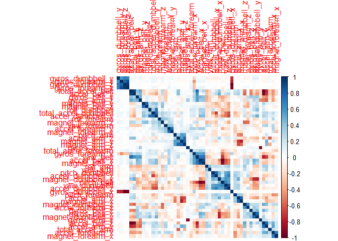
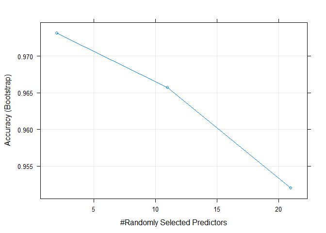
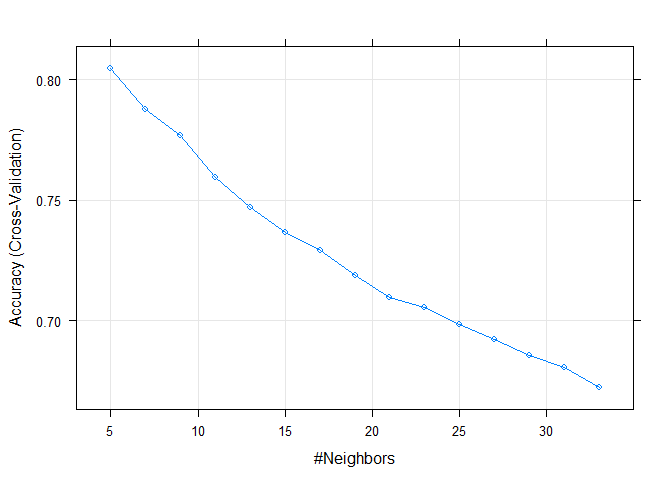

Overview
--------

We’re exploring a lifigting data set, where barbell lifts were done
correctly, and then incorrectly in 5 different ways. Data comes from the
Weight Lifting Exercise Data set at:
<a href="http://web.archive.org/web/20161224072740/http:/groupware.les.inf.puc-rio.br/har" class="uri">http://web.archive.org/web/20161224072740/http:/groupware.les.inf.puc-rio.br/har</a>

Per the website/paper, the authors tell us that there are 6 participants
“performin”one set of 10 repetitions of the Unilateral Dumbbell Biceps
Curl in five different fashions: exactly according to the specification
(Class A), throwing the elbows to the front (Class B), lifting the
dumbbell only halfway (Class C), lowering the dumbbell only halfway
(Class D) and throwing the hips to the front (Class E)."

Class A is the specified exercise, and the other 4 represent common
mistakes.

    library(caret)
    library(corrplot)
    library(randomForest)
    library(e1071)
    library(corrplot)
    library(skimr)
    library(doParallel)
    set.seed(2002)
    ##paraellell processing
    cl <- makePSOCKcluster(16)
    registerDoParallel(cl)

Read in the Data
----------------

    URL_Train <- "https://d396qusza40orc.cloudfront.net/predmachlearn/pml-training.csv"
    URL_Test <- "https://d396qusza40orc.cloudfront.net/predmachlearn/pml-testing.csv"
    training <- read.csv(url(URL_Train))
    testing <- read.csv(url(URL_Test))

Exploratory
-----------

    table(training$classe)

    ## 
    ##    A    B    C    D    E 
    ## 5580 3797 3422 3216 3607

    ## ok, somewhat evenly spread across categories, though A has a bit more...
    sum(is.na(training))/prod(dim(training))

    ## [1] 0.4100856

    ## there is a significant amount of missing data here, so we need do some cleaning since most models will choke on NAs

Cleaning/prep
-------------

    ##Let's start by looking at variables with little to no variance, and then removing variabels with missing data. Just viewing the data, we can see that generally when a column has NAs, it has a vast majority of NA's. We will assume that removing these will have little end effect on the prediction model(s).
    ##before
    dim(training)

    ## [1] 19622   160

    ltnv <- caret::nearZeroVar(training)
    training <- training[,-ltnv]
    testing <- testing[,-ltnv]
    training_cleaned <- training[,colSums(is.na(training))==0]
    testing_cleaned <- testing[,colSums(is.na(testing))==0]
    ##remove time/names
    training_cleaned <- training_cleaned[,-c(1:7)]
    testing_cleaned <- testing_cleaned[,-c(1:7)]
    ##create partition at 70%. Doing this as the 'final' test set at only 20, is small relative to the overall data set. I want to avoid over-fitting, so will use a preliminary test set.
    inTrain <- caret::createDataPartition(y=training_cleaned$classe,p=0.7,list = FALSE)
    trn <- training_cleaned[inTrain,]
    tst <- training_cleaned[-inTrain,]
    ##after
    dim(training_cleaned)

    ## [1] 19622    52

    ## Summary

Looking for correlating relationships and selecting features
------------------------------------------------------------

    #correlation matrix of features
    cor_trn <- round(cor(subset(trn, select = -classe)),2)
    corrplot::corrplot(cor_trn, method= "color", order = "hclust")

    ##too many features, we need to reduce
    ##subset to the attributes that are highy correlated
    HC <- caret::findCorrelation(cor_trn, cutoff = 0.5)
    cor_trn_sub <- cor_trn[-HC,-HC]
    ##Getting much better after removing the most correlated features
    trnFinal <- trn[,-HC]
    tstFinal <- tst[,-HC]
    skimr::skim_to_wide(trnFinal)

    ## Warning: 'skimr::skim_to_wide' is deprecated.
    ## Use 'skim()' instead.
    ## See help("Deprecated")

<table>
<caption>Data summary</caption>
<tbody>
<tr class="odd">
<td style="text-align: left;">Name</td>
<td style="text-align: left;">.data</td>
</tr>
<tr class="even">
<td style="text-align: left;">Number of rows</td>
<td style="text-align: left;">13737</td>
</tr>
<tr class="odd">
<td style="text-align: left;">Number of columns</td>
<td style="text-align: left;">22</td>
</tr>
<tr class="even">
<td style="text-align: left;">_______________________</td>
<td style="text-align: left;"></td>
</tr>
<tr class="odd">
<td style="text-align: left;">Column type frequency:</td>
<td style="text-align: left;"></td>
</tr>
<tr class="even">
<td style="text-align: left;">factor</td>
<td style="text-align: left;">1</td>
</tr>
<tr class="odd">
<td style="text-align: left;">numeric</td>
<td style="text-align: left;">21</td>
</tr>
<tr class="even">
<td style="text-align: left;">________________________</td>
<td style="text-align: left;"></td>
</tr>
<tr class="odd">
<td style="text-align: left;">Group variables</td>
<td style="text-align: left;">None</td>
</tr>
</tbody>
</table>

**Variable type: factor**

<table>
<thead>
<tr class="header">
<th style="text-align: left;">skim_variable</th>
<th style="text-align: right;">n_missing</th>
<th style="text-align: right;">complete_rate</th>
<th style="text-align: left;">ordered</th>
<th style="text-align: right;">n_unique</th>
<th style="text-align: left;">top_counts</th>
</tr>
</thead>
<tbody>
<tr class="odd">
<td style="text-align: left;">classe</td>
<td style="text-align: right;">0</td>
<td style="text-align: right;">1</td>
<td style="text-align: left;">FALSE</td>
<td style="text-align: right;">5</td>
<td style="text-align: left;">A: 3906, B: 2658, E: 2525, C: 2396</td>
</tr>
</tbody>
</table>

**Variable type: numeric**

<table>
<thead>
<tr class="header">
<th style="text-align: left;">skim_variable</th>
<th style="text-align: right;">n_missing</th>
<th style="text-align: right;">complete_rate</th>
<th style="text-align: right;">mean</th>
<th style="text-align: right;">sd</th>
<th style="text-align: right;">p0</th>
<th style="text-align: right;">p25</th>
<th style="text-align: right;">p50</th>
<th style="text-align: right;">p75</th>
<th style="text-align: right;">p100</th>
<th style="text-align: left;">hist</th>
</tr>
</thead>
<tbody>
<tr class="odd">
<td style="text-align: left;">gyros_belt_x</td>
<td style="text-align: right;">0</td>
<td style="text-align: right;">1</td>
<td style="text-align: right;">-0.01</td>
<td style="text-align: right;">0.21</td>
<td style="text-align: right;">-1.04</td>
<td style="text-align: right;">-0.03</td>
<td style="text-align: right;">0.03</td>
<td style="text-align: right;">0.11</td>
<td style="text-align: right;">1.88</td>
<td style="text-align: left;">▁▇▂▁▁</td>
</tr>
<tr class="even">
<td style="text-align: left;">gyros_belt_y</td>
<td style="text-align: right;">0</td>
<td style="text-align: right;">1</td>
<td style="text-align: right;">0.04</td>
<td style="text-align: right;">0.08</td>
<td style="text-align: right;">-0.64</td>
<td style="text-align: right;">0.00</td>
<td style="text-align: right;">0.02</td>
<td style="text-align: right;">0.11</td>
<td style="text-align: right;">0.63</td>
<td style="text-align: left;">▁▁▇▁▁</td>
</tr>
<tr class="odd">
<td style="text-align: left;">gyros_belt_z</td>
<td style="text-align: right;">0</td>
<td style="text-align: right;">1</td>
<td style="text-align: right;">-0.13</td>
<td style="text-align: right;">0.24</td>
<td style="text-align: right;">-1.46</td>
<td style="text-align: right;">-0.20</td>
<td style="text-align: right;">-0.10</td>
<td style="text-align: right;">-0.02</td>
<td style="text-align: right;">1.61</td>
<td style="text-align: left;">▁▂▇▁▁</td>
</tr>
<tr class="even">
<td style="text-align: left;">magnet_belt_y</td>
<td style="text-align: right;">0</td>
<td style="text-align: right;">1</td>
<td style="text-align: right;">593.43</td>
<td style="text-align: right;">36.12</td>
<td style="text-align: right;">359.00</td>
<td style="text-align: right;">581.00</td>
<td style="text-align: right;">601.00</td>
<td style="text-align: right;">610.00</td>
<td style="text-align: right;">673.00</td>
<td style="text-align: left;">▁▁▁▇▃</td>
</tr>
<tr class="odd">
<td style="text-align: left;">roll_arm</td>
<td style="text-align: right;">0</td>
<td style="text-align: right;">1</td>
<td style="text-align: right;">17.68</td>
<td style="text-align: right;">72.82</td>
<td style="text-align: right;">-180.00</td>
<td style="text-align: right;">-31.80</td>
<td style="text-align: right;">0.00</td>
<td style="text-align: right;">77.10</td>
<td style="text-align: right;">179.00</td>
<td style="text-align: left;">▁▃▇▆▂</td>
</tr>
<tr class="even">
<td style="text-align: left;">yaw_arm</td>
<td style="text-align: right;">0</td>
<td style="text-align: right;">1</td>
<td style="text-align: right;">-0.91</td>
<td style="text-align: right;">71.76</td>
<td style="text-align: right;">-180.00</td>
<td style="text-align: right;">-43.70</td>
<td style="text-align: right;">0.00</td>
<td style="text-align: right;">45.80</td>
<td style="text-align: right;">180.00</td>
<td style="text-align: left;">▁▅▇▃▂</td>
</tr>
<tr class="odd">
<td style="text-align: left;">total_accel_arm</td>
<td style="text-align: right;">0</td>
<td style="text-align: right;">1</td>
<td style="text-align: right;">25.54</td>
<td style="text-align: right;">10.56</td>
<td style="text-align: right;">1.00</td>
<td style="text-align: right;">17.00</td>
<td style="text-align: right;">27.00</td>
<td style="text-align: right;">33.00</td>
<td style="text-align: right;">66.00</td>
<td style="text-align: left;">▃▆▇▁▁</td>
</tr>
<tr class="even">
<td style="text-align: left;">gyros_arm_y</td>
<td style="text-align: right;">0</td>
<td style="text-align: right;">1</td>
<td style="text-align: right;">-0.25</td>
<td style="text-align: right;">0.85</td>
<td style="text-align: right;">-3.32</td>
<td style="text-align: right;">-0.80</td>
<td style="text-align: right;">-0.22</td>
<td style="text-align: right;">0.16</td>
<td style="text-align: right;">2.84</td>
<td style="text-align: left;">▁▃▇▂▁</td>
</tr>
<tr class="odd">
<td style="text-align: left;">gyros_arm_z</td>
<td style="text-align: right;">0</td>
<td style="text-align: right;">1</td>
<td style="text-align: right;">0.26</td>
<td style="text-align: right;">0.55</td>
<td style="text-align: right;">-2.33</td>
<td style="text-align: right;">-0.08</td>
<td style="text-align: right;">0.23</td>
<td style="text-align: right;">0.72</td>
<td style="text-align: right;">3.02</td>
<td style="text-align: left;">▁▂▇▂▁</td>
</tr>
<tr class="even">
<td style="text-align: left;">magnet_arm_z</td>
<td style="text-align: right;">0</td>
<td style="text-align: right;">1</td>
<td style="text-align: right;">307.20</td>
<td style="text-align: right;">326.75</td>
<td style="text-align: right;">-597.00</td>
<td style="text-align: right;">134.00</td>
<td style="text-align: right;">445.00</td>
<td style="text-align: right;">545.00</td>
<td style="text-align: right;">694.00</td>
<td style="text-align: left;">▁▂▂▃▇</td>
</tr>
<tr class="odd">
<td style="text-align: left;">roll_dumbbell</td>
<td style="text-align: right;">0</td>
<td style="text-align: right;">1</td>
<td style="text-align: right;">23.68</td>
<td style="text-align: right;">70.26</td>
<td style="text-align: right;">-153.71</td>
<td style="text-align: right;">-19.03</td>
<td style="text-align: right;">48.17</td>
<td style="text-align: right;">67.75</td>
<td style="text-align: right;">153.38</td>
<td style="text-align: left;">▂▂▃▇▂</td>
</tr>
<tr class="even">
<td style="text-align: left;">pitch_dumbbell</td>
<td style="text-align: right;">0</td>
<td style="text-align: right;">1</td>
<td style="text-align: right;">-10.61</td>
<td style="text-align: right;">36.97</td>
<td style="text-align: right;">-149.59</td>
<td style="text-align: right;">-40.70</td>
<td style="text-align: right;">-20.79</td>
<td style="text-align: right;">17.60</td>
<td style="text-align: right;">149.40</td>
<td style="text-align: left;">▁▆▇▂▁</td>
</tr>
<tr class="odd">
<td style="text-align: left;">roll_forearm</td>
<td style="text-align: right;">0</td>
<td style="text-align: right;">1</td>
<td style="text-align: right;">33.98</td>
<td style="text-align: right;">108.12</td>
<td style="text-align: right;">-180.00</td>
<td style="text-align: right;">-0.52</td>
<td style="text-align: right;">22.50</td>
<td style="text-align: right;">140.00</td>
<td style="text-align: right;">180.00</td>
<td style="text-align: left;">▃▂▇▂▇</td>
</tr>
<tr class="even">
<td style="text-align: left;">pitch_forearm</td>
<td style="text-align: right;">0</td>
<td style="text-align: right;">1</td>
<td style="text-align: right;">10.73</td>
<td style="text-align: right;">28.35</td>
<td style="text-align: right;">-72.50</td>
<td style="text-align: right;">0.00</td>
<td style="text-align: right;">9.34</td>
<td style="text-align: right;">28.60</td>
<td style="text-align: right;">88.70</td>
<td style="text-align: left;">▁▁▇▃▁</td>
</tr>
<tr class="odd">
<td style="text-align: left;">yaw_forearm</td>
<td style="text-align: right;">0</td>
<td style="text-align: right;">1</td>
<td style="text-align: right;">19.44</td>
<td style="text-align: right;">103.16</td>
<td style="text-align: right;">-180.00</td>
<td style="text-align: right;">-68.40</td>
<td style="text-align: right;">0.00</td>
<td style="text-align: right;">110.00</td>
<td style="text-align: right;">180.00</td>
<td style="text-align: left;">▅▅▇▆▇</td>
</tr>
<tr class="even">
<td style="text-align: left;">total_accel_forearm</td>
<td style="text-align: right;">0</td>
<td style="text-align: right;">1</td>
<td style="text-align: right;">34.70</td>
<td style="text-align: right;">10.00</td>
<td style="text-align: right;">0.00</td>
<td style="text-align: right;">29.00</td>
<td style="text-align: right;">36.00</td>
<td style="text-align: right;">41.00</td>
<td style="text-align: right;">108.00</td>
<td style="text-align: left;">▁▇▂▁▁</td>
</tr>
<tr class="odd">
<td style="text-align: left;">gyros_forearm_x</td>
<td style="text-align: right;">0</td>
<td style="text-align: right;">1</td>
<td style="text-align: right;">0.16</td>
<td style="text-align: right;">0.65</td>
<td style="text-align: right;">-22.00</td>
<td style="text-align: right;">-0.21</td>
<td style="text-align: right;">0.05</td>
<td style="text-align: right;">0.56</td>
<td style="text-align: right;">3.52</td>
<td style="text-align: left;">▁▁▁▁▇</td>
</tr>
<tr class="even">
<td style="text-align: left;">gyros_forearm_y</td>
<td style="text-align: right;">0</td>
<td style="text-align: right;">1</td>
<td style="text-align: right;">0.09</td>
<td style="text-align: right;">3.42</td>
<td style="text-align: right;">-6.45</td>
<td style="text-align: right;">-1.46</td>
<td style="text-align: right;">0.03</td>
<td style="text-align: right;">1.64</td>
<td style="text-align: right;">311.00</td>
<td style="text-align: left;">▇▁▁▁▁</td>
</tr>
<tr class="odd">
<td style="text-align: left;">accel_forearm_z</td>
<td style="text-align: right;">0</td>
<td style="text-align: right;">1</td>
<td style="text-align: right;">-56.04</td>
<td style="text-align: right;">138.40</td>
<td style="text-align: right;">-446.00</td>
<td style="text-align: right;">-182.00</td>
<td style="text-align: right;">-41.00</td>
<td style="text-align: right;">26.00</td>
<td style="text-align: right;">285.00</td>
<td style="text-align: left;">▁▇▅▅▃</td>
</tr>
<tr class="even">
<td style="text-align: left;">magnet_forearm_x</td>
<td style="text-align: right;">0</td>
<td style="text-align: right;">1</td>
<td style="text-align: right;">-311.86</td>
<td style="text-align: right;">347.46</td>
<td style="text-align: right;">-1280.00</td>
<td style="text-align: right;">-617.00</td>
<td style="text-align: right;">-375.00</td>
<td style="text-align: right;">-71.00</td>
<td style="text-align: right;">672.00</td>
<td style="text-align: left;">▁▇▆▅▂</td>
</tr>
<tr class="odd">
<td style="text-align: left;">magnet_forearm_y</td>
<td style="text-align: right;">0</td>
<td style="text-align: right;">1</td>
<td style="text-align: right;">380.76</td>
<td style="text-align: right;">508.24</td>
<td style="text-align: right;">-896.00</td>
<td style="text-align: right;">15.00</td>
<td style="text-align: right;">591.00</td>
<td style="text-align: right;">737.00</td>
<td style="text-align: right;">1460.00</td>
<td style="text-align: left;">▂▂▂▇▁</td>
</tr>
</tbody>
</table>

Model
-----

Using random forest as the authors also selected due to the high number
of values. Though the paper doesn’t detail methodology, we will compare
results. It is likely they will be different, as I have significantly
subset the number of features.

Random Forest
-------------

    ## Using k-fold defaults
    TC <- caret::trainControl(method = "cv", number = 3, verboseIter = FALSE)
    ## warning! takes a while to process!
    train_out <- caret::train(classe~., data = trnFinal, method = "rf", metric = "Accuracy", trConrol = TC)
    ## Model Summary:
    train_out$finalModel

    ## 
    ## Call:
    ##  randomForest(x = x, y = y, mtry = param$mtry, trConrol = ..1) 
    ##                Type of random forest: classification
    ##                      Number of trees: 500
    ## No. of variables tried at each split: 2
    ## 
    ##         OOB estimate of  error rate: 1.97%
    ## Confusion matrix:
    ##      A    B    C    D    E class.error
    ## A 3881   14    3    5    3 0.006400410
    ## B   48 2594   11    3    2 0.024078254
    ## C    3   42 2331   18    2 0.027128548
    ## D    3    3   92 2150    4 0.045293073
    ## E    2    0    4    9 2510 0.005940594

    plot(train_out)

    ## Let's apply our model to predict our test set now:
    predict_out <- predict(train_out, newdata = tstFinal)
    pred_CM <- confusionMatrix(predict_out, tstFinal$classe)
    pred_CM

    ## Confusion Matrix and Statistics
    ## 
    ##           Reference
    ## Prediction    A    B    C    D    E
    ##          A 1669   18    3    0    1
    ##          B    3 1112   23    1    2
    ##          C    0    5  991   43    0
    ##          D    2    1    8  920    2
    ##          E    0    3    1    0 1077
    ## 
    ## Overall Statistics
    ##                                           
    ##                Accuracy : 0.9803          
    ##                  95% CI : (0.9764, 0.9837)
    ##     No Information Rate : 0.2845          
    ##     P-Value [Acc > NIR] : < 2.2e-16       
    ##                                           
    ##                   Kappa : 0.9751          
    ##                                           
    ##  Mcnemar's Test P-Value : 2.541e-08       
    ## 
    ## Statistics by Class:
    ## 
    ##                      Class: A Class: B Class: C Class: D Class: E
    ## Sensitivity            0.9970   0.9763   0.9659   0.9544   0.9954
    ## Specificity            0.9948   0.9939   0.9901   0.9974   0.9992
    ## Pos Pred Value         0.9870   0.9746   0.9538   0.9861   0.9963
    ## Neg Pred Value         0.9988   0.9943   0.9928   0.9911   0.9990
    ## Prevalence             0.2845   0.1935   0.1743   0.1638   0.1839
    ## Detection Rate         0.2836   0.1890   0.1684   0.1563   0.1830
    ## Detection Prevalence   0.2873   0.1939   0.1766   0.1585   0.1837
    ## Balanced Accuracy      0.9959   0.9851   0.9780   0.9759   0.9973

    plot(train_out)

    ## This is VERY high, so concerned we over-fitted...

    ## Let's try another model: K Kearest Neighbor  (method = "knn")
    TC2 <- caret::trainControl(method = "cv", number =15, verboseIter = FALSE)
    nn <- caret::train(classe~.,method = "knn", data=trnFinal, tuneLength = 15, trControl = TC2)
    nn

    ## k-Nearest Neighbors 
    ## 
    ## 13737 samples
    ##    21 predictor
    ##     5 classes: 'A', 'B', 'C', 'D', 'E' 
    ## 
    ## No pre-processing
    ## Resampling: Cross-Validated (15 fold) 
    ## Summary of sample sizes: 12822, 12820, 12821, 12821, 12822, 12821, ... 
    ## Resampling results across tuning parameters:
    ## 
    ##   k   Accuracy   Kappa    
    ##    5  0.8043948  0.7530273
    ##    7  0.7876547  0.7319338
    ##    9  0.7766637  0.7181148
    ##   11  0.7593366  0.6962505
    ##   13  0.7468848  0.6806194
    ##   15  0.7364015  0.6673927
    ##   17  0.7289775  0.6581334
    ##   19  0.7187133  0.6451824
    ##   21  0.7093958  0.6335229
    ##   23  0.7053180  0.6284257
    ##   25  0.6983297  0.6196741
    ##   27  0.6922144  0.6119588
    ##   29  0.6854454  0.6034720
    ##   31  0.6803511  0.5968638
    ##   33  0.6724163  0.5869196
    ## 
    ## Accuracy was used to select the optimal model using the largest value.
    ## The final value used for the model was k = 5.

    plot(nn)

    ## not as good, but far less of a chance of overfit. Let's look at prediction
    predict_out2 <- predict(nn, newdata = tstFinal)
    pred_CM2 <- confusionMatrix(predict_out2, tstFinal$classe)
    pred_CM2

    ## Confusion Matrix and Statistics
    ## 
    ##           Reference
    ## Prediction    A    B    C    D    E
    ##          A 1520   86   20   33   19
    ##          B   43  834   59   34   97
    ##          C   45   76  837  109   72
    ##          D   50   66   68  745  103
    ##          E   16   77   42   43  791
    ## 
    ## Overall Statistics
    ##                                           
    ##                Accuracy : 0.8032          
    ##                  95% CI : (0.7928, 0.8133)
    ##     No Information Rate : 0.2845          
    ##     P-Value [Acc > NIR] : < 2.2e-16       
    ##                                           
    ##                   Kappa : 0.7513          
    ##                                           
    ##  Mcnemar's Test P-Value : 6.802e-14       
    ## 
    ## Statistics by Class:
    ## 
    ##                      Class: A Class: B Class: C Class: D Class: E
    ## Sensitivity            0.9080   0.7322   0.8158   0.7728   0.7311
    ## Specificity            0.9625   0.9509   0.9378   0.9417   0.9629
    ## Pos Pred Value         0.9058   0.7816   0.7349   0.7219   0.8163
    ## Neg Pred Value         0.9634   0.9367   0.9602   0.9549   0.9408
    ## Prevalence             0.2845   0.1935   0.1743   0.1638   0.1839
    ## Detection Rate         0.2583   0.1417   0.1422   0.1266   0.1344
    ## Detection Prevalence   0.2851   0.1813   0.1935   0.1754   0.1647
    ## Balanced Accuracy      0.9352   0.8416   0.8768   0.8573   0.8470

    predictors(nn)

    ##  [1] "gyros_belt_x"        "gyros_belt_y"        "gyros_belt_z"       
    ##  [4] "magnet_belt_y"       "roll_arm"            "yaw_arm"            
    ##  [7] "total_accel_arm"     "gyros_arm_y"         "gyros_arm_z"        
    ## [10] "magnet_arm_z"        "roll_dumbbell"       "pitch_dumbbell"     
    ## [13] "roll_forearm"        "pitch_forearm"       "yaw_forearm"        
    ## [16] "total_accel_forearm" "gyros_forearm_x"     "gyros_forearm_y"    
    ## [19] "accel_forearm_z"     "magnet_forearm_x"    "magnet_forearm_y"

    ## Stop parallel workers
    stopCluster(cl)

Conclusion
----------

Random forest seemed to build a highly accurate model (~98%), but has
the warning signs of over-fitting and took ~15minutes on a core i7 to
process. KNN processed much more quickly, but was less accurate (~82%) -
though i only did minor tuning, and it could probably be improved. In
Both cases, the rank order of predictor variables is the same and there
is evidence that the top handful of predictors have an outset influence
on outcome.

Citation:
---------

Velloso, E.; Bulling, A.; Gellersen, H.; Ugulino, W.; Fuks, H.
Qualitative Activity Recognition of Weight Lifting Exercises.
Proceedings of 4th International Conference in Cooperation with SIGCHI
(Augmented Human ’13) . Stuttgart, Germany: ACM SIGCHI, 2013.
